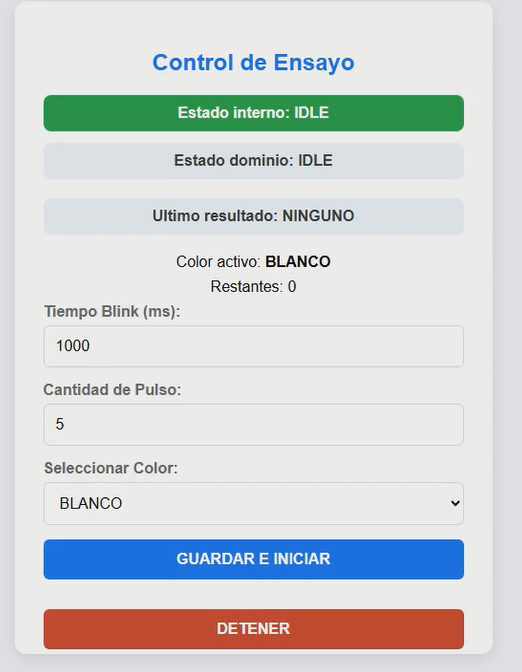
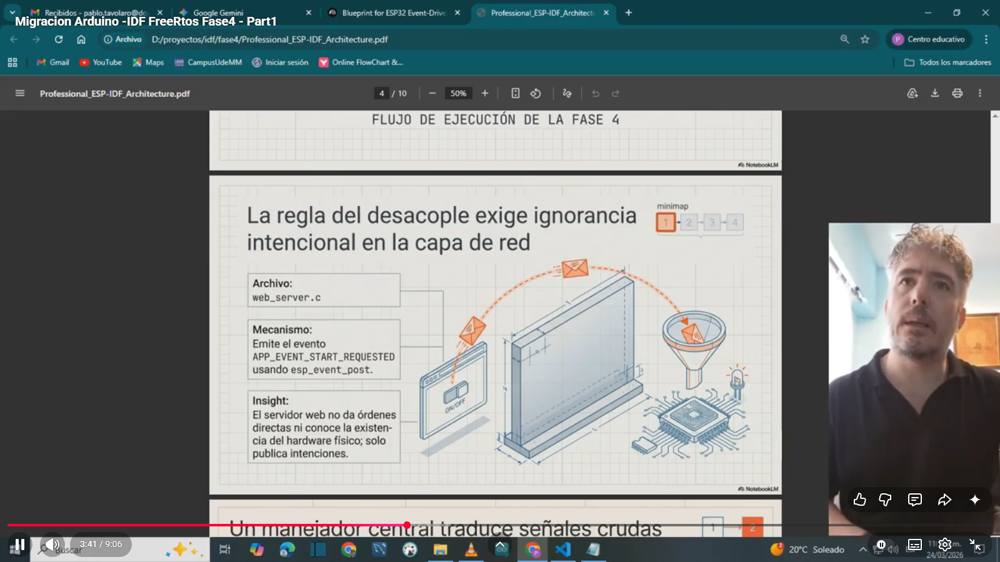
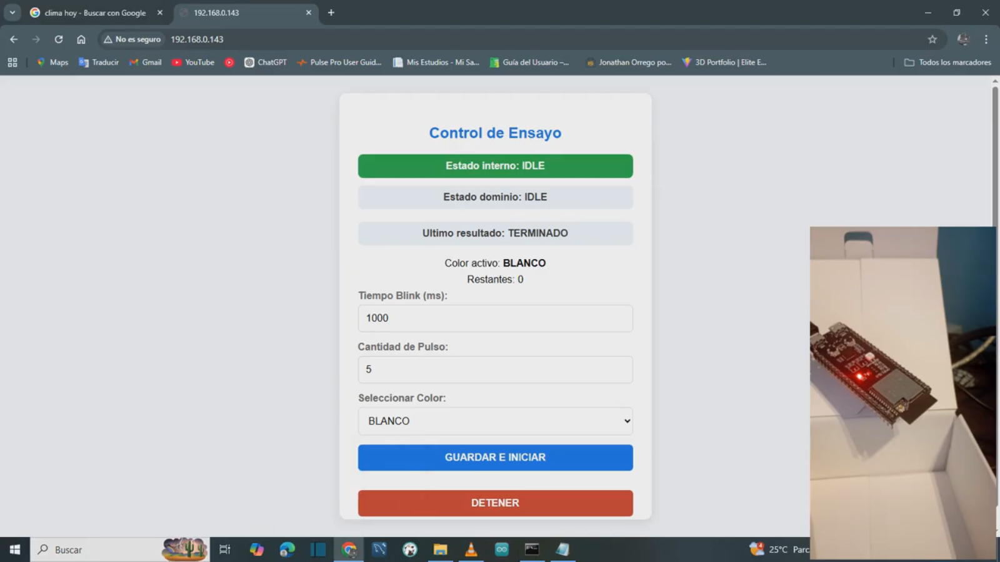

# IDF EventSystems LED

Este proyecto forma parte de una serie didáctica que muestra cómo migrar firmware
desde una arquitectura estilo Arduino hacia una arquitectura nativa de ESP‑IDF
utilizando FreeRTOS.

El punto de partida es el proyecto basado en Arduino:

https://github.com/theinsideshine/esp32S3-led-arduino

El objetivo es migrar esa arquitectura paso a paso hacia un diseño de firmware
embebido profesional.

El foco de este repositorio no es solo la funcionalidad, sino también explicar
la transición arquitectónica desde un modelo secuencial hacia un modelo concurrente
basado en RTOS.

------------------------------------------------------------

## Objetivo del Proyecto

La mayoría de los proyectos en Arduino utilizan un modelo de ejecución secuencial:

loop()
{
    web
    control
    estados
}

Todo ocurre dentro de un único flujo de ejecución.

Los sistemas embebidos modernos, en cambio, se basan en arquitecturas concurrentes
utilizando:

- FreeRTOS
- event loops
- tareas independientes
- comunicación entre tareas
- configuración persistente

Este repositorio muestra cómo evolucionar hacia ese modelo paso a paso.

------------------------------------------------------------

## Estrategia del Repositorio

El desarrollo está organizado en fases incrementales.

Cada fase introduce un concepto arquitectónico nuevo y queda almacenada en el
historial del repositorio utilizando ramas (branches).

Ejemplo de estructura:

main      -> última fase estable
phase1    -> abstracción de hardware
phase2    -> configuración + NVS + WiFi + Web
phase3    -> separación RTOS (WEB / CORE)
phase4    -> arquitectura completamente orientada a eventos

Esto permite que los estudiantes inspeccionen cómo evoluciona la arquitectura.

------------------------------------------------------------

## Hardware

Placa

ESP32-S3-DevKitC-1

LED RGB integrado

GPIO 48 (WS2812B)

------------------------------------------------------------

## Requisitos de Software

ESP-IDF v5.x

Guía de instalación:

https://docs.espressif.com/projects/esp-idf/en/latest/esp32/get-started/

------------------------------------------------------------

## Compilar y Flashear

Clonar el repositorio

git clone https://github.com/theinsideshine/idf_eventsystems_led.git

Entrar al directorio del proyecto

cd idf_eventsystems_led

Compilar y flashear

idf.py build flash monitor

------------------------------------------------------------

## Arquitectura del Software

El firmware está organizado en módulos independientes.

main
 ├── led_control
 ├── timer_control
 ├── config_manager
 ├── wifi_manager
 ├── web_server
 └── app_runtime

Cada módulo tiene una responsabilidad clara.

------------------------------------------------------------

# Fase 1 - Abstracción de Hardware

Objetivo

Separar el acceso al hardware de la lógica de la aplicación.

Módulos introducidos

led_control

Encapsula el control del LED RGB direccionable utilizando el periférico RMT.

Responsabilidades

- inicialización del LED
- control de color
- abstracción del driver

timer_control

Implementa temporizadores no bloqueantes basados en los ticks de FreeRTOS.

Evita el uso de delay() y permite que la CPU continúe ejecutando otras tareas.

------------------------------------------------------------

# Fase 2 - Configuración Persistente y Conectividad

Esta fase introduce tres componentes clave:

- configuración persistente
- conectividad WiFi
- interfaz web

config_manager

Gestiona la configuración persistente utilizando NVS.

Arquitectura utilizada:

NVS -> RAM (copia de trabajo)

Al arrancar el sistema:

config_load()

carga la configuración desde NVS hacia la RAM.

Los setters modifican únicamente la copia en RAM.

La persistencia ocurre solo cuando se llama a:

config_save()

Ejemplo de parámetros persistentes:

led_blink_time
led_blink_quantity
led_color
wifi_ssid
wifi_pass
log_level

------------------------------------------------------------

wifi_manager

Inicializa el stack de WiFi y gestiona la conexión en modo estación.

Utiliza el event loop de ESP-IDF para reaccionar a eventos como:

WIFI_EVENT_STA_START
WIFI_EVENT_STA_DISCONNECTED
IP_EVENT_STA_GOT_IP

------------------------------------------------------------

web_server

Proporciona una interfaz HTTP para:

- ver el estado del sistema
- cambiar la configuración
- guardar parámetros

Flujo típico:

Browser
   |
web_server
   |
config_set()
   |
config_save()

------------------------------------------------------------

app_runtime

Contiene el estado dinámico del sistema en ejecución.

Ejemplos:

running
state
remaining

Estos valores:

- existen solo en RAM
- no se almacenan en NVS
- se reinician al reiniciar el dispositivo

Esto separa claramente:

CONFIGURACIÓN (persistente)
ESTADO DE EJECUCIÓN (volátil)

------------------------------------------------------------

# Arquitectura  (Fase 2)

Browser
   |
WEB SERVER
   |
config_manager
   |
app_runtime
   |
LED control

El sistema ya incluye:

- configuración persistente
- conectividad WiFi
- servidor web
- temporización no bloqueante

Pero la ejecución todavía está centralizada.

------------------------------------------------------------

# Fase 3 - Separación de Tareas (WEB + CORE) 

Esta fase introduce una arquitectura RTOS real.

Se crean dos tareas independientes:

WEB TASK
CORE TASK

La comunicación ocurre mediante una cola de FreeRTOS.

Arquitectura objetivo:

Browser
   |
WEB SERVER TASK
   |
QUEUE
   |
CORE TASK
   |
LED / TEST

El servidor web ya no controla el hardware directamente.
Solo envía comandos.

Ejemplo de comandos:

APP_CMD_START
APP_CMD_STOP

------------------------------------------------------------

# Fase 4 - Sistema Completamente Orientado a Eventos (Actual)

El paso final convierte el firmware en una arquitectura completamente orientada a eventos.

En lugar de comandos directos entre módulos, el sistema reacciona a eventos.

Ejemplo de eventos:

EVT_WEB_SAVE
EVT_TEST_START
EVT_TEST_STOP
EVT_LED_ON
EVT_LED_OFF
EVT_WIFI_CONNECTED
EVT_WIFI_DISCONNECTED
EVT_TEST_FINISHED

Arquitectura objetivo:

Browser
   |
WEB SERVER
   |
EVENT BUS
   |
EVENT HANDLERS
   |
SYSTEM MODULES

Ventajas:

- fuerte desacoplamiento
- mayor escalabilidad
- mejor observabilidad del sistema
- arquitectura de firmware modular

------------------------------------------------------------

# Objetivo Didáctico Final

Mostrar la evolución completa:

Arduino loop
    |
abstracción de hardware
    |
configuración persistente
    |
WiFi + interfaz web
    |
separación de tareas con RTOS
    |
arquitectura orientada a eventos

El objetivo es ayudar a los desarrolladores a entender cómo se estructura
un firmware embebido profesional utilizando ESP-IDF y FreeRTOS.


------------------------------------------------------------

## Logs de Diagnóstico y Flujo de Ejecución

Durante la Fase 3 se agregaron logs de diagnóstico para verificar tanto
el arranque del firmware como el flujo completo de ejecución entre módulos.

Estos logs permiten observar claramente la arquitectura RTOS implementada:

Browser
   |
WEB SERVER
   |
APP QUEUE
   |
CORE TASK
   |
LED / TEST

De esta forma se puede comprobar:

- qué firmware está realmente ejecutándose
- cuándo llega un comando desde la web
- cuándo ese comando entra en la cola
- cuándo la tarea CORE lo procesa
- cómo avanza el ensayo hasta finalizar

------------------------------------------------------------

### Logs de Arranque

Al inicio de `app_main()` se agregan los siguientes logs:

```c
ESP_LOGI("BOOTCHK", "SW_VERSION=%s", SW_VERSION);
ESP_LOGI("BOOTCHK", "Compiled: %s %s", __DATE__, __TIME__);
ESP_LOGI(TAG, "Inicializando Fase 3");
```

Ejemplo de salida:

```text
I (420) BOOTCHK: SW_VERSION=3.0.3
I (420) BOOTCHK: Compiled: Mar 16 2026 15:12:43
I (420) MAIN: Inicializando Fase 3
```

Explicación:

- `SW_VERSION` muestra la versión lógica del firmware definida en el proyecto
- `Compiled` muestra la fecha y hora exacta de compilación del binario
- `Inicializando Fase 3` marca el inicio de la secuencia principal de arranque

Estos logs son útiles para confirmar que el ESP32 está ejecutando el binario
correcto y no una versión anterior.

------------------------------------------------------------

### Log de Comando Recibido desde la Web

Cuando el usuario envía una acción desde la interfaz web, el servidor web
genera un log como el siguiente:

```text
I (19560) WEB_SERVER: WEB_CMD APPLY_CONFIG t=5000 q=4 color=9 save=1 start=1
```

Explicación:

- `WEB_CMD APPLY_CONFIG` indica que la web recibió una solicitud para aplicar configuración
- `t=5000` representa el tiempo de blink en milisegundos
- `q=4` representa la cantidad de pulsos
- `color=9` representa el color solicitado
- `save=1` indica que la configuración debe guardarse en NVS
- `start=1` indica que además debe iniciarse el ensayo

Este log confirma que el comando fue correctamente interpretado por el módulo web.

------------------------------------------------------------

### Log de Encolado del Comando

Una vez recibido, el comando no se ejecuta directamente desde la web.
Primero se coloca en la cola principal del sistema:

```text
I (19560) APP_QUEUE: CMD queued type=3
```

Explicación:

- `CMD queued` indica que el comando fue agregado a la cola RTOS
- `type=3` identifica internamente el tipo de comando enviado

Este log demuestra que la comunicación entre WEB y CORE ocurre de forma desacoplada.

------------------------------------------------------------

### Log de Procesamiento en CORE_TASK

La tarea `CORE_TASK` toma el comando desde la cola y comienza a procesarlo:

```text
I (19570) CORE_TASK: CORE processing CMD type=3
I (19570) CORE_TASK: CMD APPLY_CONFIG
```

Explicación:

- `CORE processing CMD type=3` indica que la tarea CORE extrajo el comando de la cola
- `CMD APPLY_CONFIG` indica qué acción lógica se decidió ejecutar

Este es uno de los logs más importantes de Fase 3 porque muestra claramente
la separación entre productor de comandos y consumidor de comandos.

------------------------------------------------------------

### Log de Inicio del Ensayo

Cuando la tarea CORE inicia el ensayo, aparece un log como este:

```text
I (35360) CORE_TASK: ENSAYO START color=1 pulses=4 blink=1000ms
```

Explicación:

- `ENSAYO START` indica el inicio del ciclo de prueba
- `color=1` indica el color que se aplicará al LED
- `pulses=4` indica la cantidad total de pulsos
- `blink=1000ms` indica la duración configurada del blink

Este log marca el punto exacto donde la lógica de aplicación comienza a ejecutarse.

------------------------------------------------------------

### Logs de Progreso del Ensayo

Durante la ejecución se informa cuántos pulsos restan:

```text
I (37360) CORE_TASK: PULSE remaining=3
I (39360) CORE_TASK: PULSE remaining=2
I (41360) CORE_TASK: PULSE remaining=1
I (43360) CORE_TASK: PULSE remaining=0
```

Explicación:

- `PULSE remaining=N` indica la cantidad de pulsos pendientes
- estos logs permiten seguir el avance del ensayo en tiempo real

Son útiles para validar temporización, lógica de decremento y secuencia de ejecución.

------------------------------------------------------------

### Log de Finalización

Cuando el ensayo termina correctamente se genera el siguiente log:

```text
I (43360) CORE_TASK: ENSAYO FINISHED
```

Explicación:

- `ENSAYO FINISHED` indica que el ciclo completo finalizó
- confirma que todos los pulsos fueron ejecutados y que la tarea terminó el proceso esperado

------------------------------------------------------------

### Ejemplo Completo de Flujo

El siguiente bloque resume el flujo real de Fase 3:

```text
I (19560) WEB_SERVER: WEB_CMD APPLY_CONFIG t=5000 q=4 color=9 save=1 start=1
I (19560) APP_QUEUE: CMD queued type=3
I (19570) CORE_TASK: CORE processing CMD type=3
I (19570) CORE_TASK: CMD APPLY_CONFIG
I (19580) CORE_TASK: ENSAYO START color=9 pulses=4 blink=5000ms
I (35330) WEB_SERVER: WEB_CMD APPLY_CONFIG t=1000 q=4 color=1 save=1 start=1
I (35330) APP_QUEUE: CMD queued type=3
I (35340) CORE_TASK: CORE processing CMD type=3
I (35340) CORE_TASK: CMD APPLY_CONFIG
I (35360) CORE_TASK: ENSAYO START color=1 pulses=4 blink=1000ms
I (37360) CORE_TASK: PULSE remaining=3
I (39360) CORE_TASK: PULSE remaining=2
I (41360) CORE_TASK: PULSE remaining=1
I (43360) CORE_TASK: PULSE remaining=0
I (43360) CORE_TASK: ENSAYO FINISHED
```

Este flujo permite ver claramente la secuencia:

1. la web recibe el comando
2. la cola lo transporta
3. la tarea CORE lo procesa
4. el ensayo se ejecuta
5. el sistema informa su finalización

------------------------------------------------------------

### Objetivo Didáctico de Estos Logs

Estos logs no solo sirven para depurar.

También ayudan a mostrar, de manera concreta, la transición desde una arquitectura
secuencial estilo Arduino hacia una arquitectura concurrente basada en FreeRTOS.

En Fase 3 ya no existe control directo desde la web hacia el hardware.

La arquitectura pasa a ser:

- WEB como productor de comandos
- APP_QUEUE como canal de comunicación
- CORE_TASK como ejecutor de la lógica de control

Esto representa un paso real hacia un firmware embebido profesional,
modular y desacoplado.


------------------------------------------------------------

------------------------------------------------------------

## Demo Visual

A continuación se muestra una vista de la interfaz web y una demo del sistema
en funcionamiento, incluyendo:

- interacción desde navegador
- ejecución del blink en el LED físico
- salida de logs en tiempo real

### Video de Demo

[](https://youtu.be/KUGWflF_wo0)


### FASE 1/2


[](https://youtu.be/3Th4_aNCwcc)


[](https://youtu.be/wPU-klHYiZs)


> Hacer clic sobre la imagen para reproducir la demo en YouTube.


La interfaz permite:

- configurar el tiempo de blink
- definir la cantidad de pulsos
- seleccionar el color activo
- iniciar o detener la secuencia desde la web

En esta fase, la web actúa únicamente como productor de comandos.
La ejecución real del comportamiento queda desacoplada y delegada al sistema interno
basado en cola de eventos y tarea de control.

------------------------------------------------------------

### Objetivo Didáctico de Estos Logs

Estos logs no solo sirven para depurar.

También ayudan a mostrar, de manera concreta, la transición desde una arquitectura
secuencial estilo Arduino hacia una arquitectura concurrente basada en FreeRTOS.

En Fase 3 ya no existe control directo desde la web hacia el hardware.

La arquitectura pasa a ser:

- WEB como productor de comandos
- APP_QUEUE como canal de comunicación
- CORE_TASK como ejecutor de la lógica de control

Esto representa un paso real hacia un firmware embebido profesional,
modular y desacoplado.

------------------------------------------------------------

# Fase 4 - Arquitectura Orientada a Eventos (Actual)

Esta fase introduce un cambio conceptual importante en la arquitectura.

El sistema deja de estar basado en comandos directos entre módulos y pasa a
estar basado en eventos.

La web ya no envía comandos directamente a la cola.

En su lugar, publica eventos de intención.

------------------------------------------------------------

## Concepto Clave

Antes (Fase 3):

WEB -> QUEUE -> CORE_TASK

Ahora (Fase 4):

WEB -> EVENTOS -> HANDLER -> QUEUE -> CORE_TASK

------------------------------------------------------------

## Flujo del Sistema

1. El usuario interactúa desde la web
2. El servidor web publica eventos
3. Un manejador de eventos (coordinador) procesa esos eventos
4. El manejador traduce eventos a comandos internos
5. La cola transporta esos comandos hacia CORE_TASK
6. CORE_TASK ejecuta la lógica del ensayo
7. CORE_TASK publica eventos de resultado

------------------------------------------------------------

## Eventos Introducidos

Eventos de entrada (intención):

- APP_EVENT_CONFIG_UPDATED
- APP_EVENT_START_REQUESTED
- APP_EVENT_STOP_REQUESTED

Eventos de salida (resultado):

- APP_EVENT_ENSAYO_STARTED
- APP_EVENT_ENSAYO_FINISHED
- APP_EVENT_ENSAYO_STOPPED

------------------------------------------------------------

## Módulo app_events

Se introduce un nuevo módulo:

app_events

Responsabilidades:

- definir el bus de eventos del sistema
- registrar handlers
- publicar eventos
- actuar como coordinador

Este módulo desacopla completamente la web de la ejecución.

------------------------------------------------------------

## Cambio en web_server

Antes:

WEB -> APP_QUEUE

Ahora:

WEB -> EVENTOS

Ejemplo:

Antes:
WEB_CMD APPLY_CONFIG

Ahora:
WEB_EVENT CONFIG_UPDATED
WEB_EVENT START_REQUESTED

La web deja de conocer la cola y la ejecución interna.

------------------------------------------------------------

## Rol del Event Handler

El manejador de eventos:

- recibe eventos de intención
- valida el estado del sistema
- decide si la acción es válida
- traduce a comandos internos (cola)

Ejemplo:

START_REQUESTED
   -> validación
   -> envío de APP_CMD_START a la cola

------------------------------------------------------------

## CORE_TASK (sin cambios estructurales)

CORE_TASK mantiene su responsabilidad:

- ejecutar la FSM del ensayo
- controlar el LED
- manejar temporización

Pero ahora:

- no recibe comandos de la web directamente
- recibe comandos internos generados por eventos

------------------------------------------------------------

## Eventos de Resultado

CORE_TASK ahora informa al sistema cuando ocurre algo importante:

- inicio real del ensayo
- finalización
- detención

Ejemplo:

ENSAYO_STARTED
ENSAYO_FINISHED
ENSAYO_STOPPED

Esto permite que otros módulos reaccionen sin acoplamiento.

------------------------------------------------------------

## Fase 4.1 - Estado de Dominio y Resultado

Se agrega información semántica al runtime:

app_runtime ahora incluye:

- domain_status
- last_result

------------------------------------------------------------

### domain_status

Representa el estado global del sistema:

- IDLE
- RUNNING

No depende de la FSM interna.

------------------------------------------------------------

### last_result

Representa el último resultado observable del sistema:

- NONE
- FINISHED
- STOPPED
- REJECTED

Esto permite distinguir claramente cómo terminó un ensayo.

------------------------------------------------------------

## Casos de Ejecución

Inicio correcto:

- START_REQUESTED
- ENSAYO_STARTED
- domain_status = RUNNING
- last_result = NONE

Finalización normal:

- ENSAYO_FINISHED
- domain_status = IDLE
- last_result = FINISHED

Detención manual:

- STOP_REQUESTED
- ENSAYO_STOPPED
- domain_status = IDLE
- last_result = STOPPED

Rechazo:

- START_REQUESTED mientras está corriendo
- last_result = REJECTED

------------------------------------------------------------

## Cambios en la Interfaz Web

La interfaz ahora muestra:

- estado interno (FSM)
- estado de dominio
- último resultado

Esto permite visualizar claramente el comportamiento del sistema.

------------------------------------------------------------

## Nueva Arquitectura

Browser
   |
WEB SERVER
   |
EVENT BUS
   |
EVENT HANDLER (COORDINADOR)
   |
QUEUE (interna)
   |
CORE TASK
   |
LED / TEST

------------------------------------------------------------

## Ventajas de la Fase 4

- desacoplamiento completo entre módulos
- separación entre intención y ejecución
- mejor trazabilidad del sistema
- mayor claridad semántica
- base para sistemas más complejos

------------------------------------------------------------

## Objetivo Didáctico

Mostrar la transición desde:

- control directo (Arduino)
- comandos desacoplados (Fase 3)
- eventos y coordinación (Fase 4)

El sistema pasa de:

"hacer cosas"

a:

"reaccionar a eventos"

Esto representa un paso clave hacia firmware embebido profesional.


Autor: theinsideshine
Licencia: MIT


