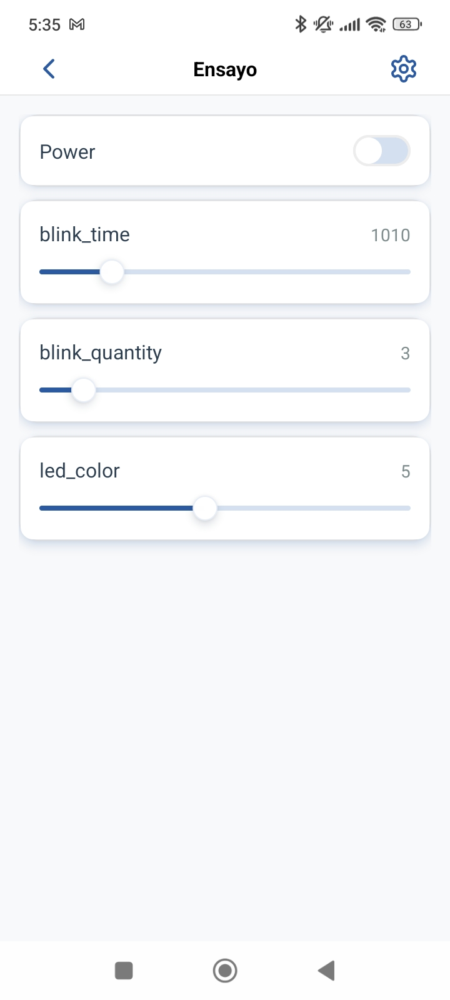

# IDF EventSystems LED

Este proyecto forma parte de una serie didáctica que muestra cómo migrar firmware
desde una arquitectura estilo Arduino hacia una arquitectura nativa de ESP-IDF
utilizando FreeRTOS.

Repositorio base Arduino:
https://github.com/theinsideshine/esp32S3-led-arduino

El objetivo es evolucionar progresivamente hacia un firmware embebido profesional,
modular, concurrente y orientado a eventos.

---

## Estado Actual (Fase 5)

El sistema actualmente incluye:

* BLE provisioning (ESP RainMaker)
* Conectividad WiFi automática
* Integración con cloud (MQTT)
* Control desde app móvil (RainMaker)
* Servidor web local
* Persistencia en NVS (configuración propia)
* Arquitectura basada en eventos + RTOS
* Control físico del LED validado

Flujo completo validado:

App (RainMaker)
|
Cloud (MQTT)
|
Callback (RainMaker Adapter)
|
Eventos
|
Queue
|
CORE TASK
|
LED físico

---

## Arquitectura General

El firmware está organizado en módulos independientes:

main
├── led_control
├── config_manager
├── app_runtime
├── app_events
├── app_queue
├── core_task
├── web_server
├── wifi_manager
└── rainmaker_adapter

Cada módulo tiene una responsabilidad clara y desacoplada.

---

## Hardware

Placa:
ESP32-S3-DevKitC-1

LED:
WS2812B (GPIO 48)

---

## Requisitos

ESP-IDF v5.x

https://docs.espressif.com/projects/esp-idf/en/latest/

---

## Compilación

idf.py build flash monitor

---

# Fase 1 - Abstracción de Hardware

* led_control
* timer_control

Separación completa del hardware.

---

# Fase 2 - Configuración + WiFi + Web

* config_manager (NVS)
* wifi_manager
* web_server

Separación clara entre:

CONFIGURACIÓN (persistente)
ESTADO (runtime)

---

# Fase 3 - Separación RTOS

* WEB TASK
* CORE TASK
* comunicación por cola

WEB deja de ejecutar directamente.

---

# Fase 4 - Arquitectura por Eventos

WEB → EVENTOS → HANDLER → QUEUE → CORE

Se elimina acoplamiento directo.

Se introducen:

* APP_EVENT_START_REQUESTED
* APP_EVENT_STOP_REQUESTED
* APP_EVENT_CONFIG_UPDATED
* APP_EVENT_ENSAYO_STARTED
* APP_EVENT_ENSAYO_FINISHED

---

# Fase 4.1 - Estado de Dominio

Se agregan:

domain_status:

* IDLE
* RUNNING

last_result:

* NONE
* FINISHED
* STOPPED
* REJECTED

---

# Fase 5 - Integración RainMaker + BLE

Se incorpora:

* ESP RainMaker
* Provisioning BLE
* Control remoto desde app

---

## Flujo de Provisioning

1. Dispositivo arranca sin WiFi
2. Entra en modo BLE provisioning
3. App detecta dispositivo
4. Usuario configura WiFi
5. Dispositivo obtiene IP
6. Se conecta a cloud
7. Se registra en RainMaker

---

## Flujo de Control desde App

1. Usuario presiona ON en app
2. RainMaker envía comando por MQTT
3. Callback en rainmaker_adapter
4. Se genera evento interno
5. Evento pasa por app_events
6. Se convierte en comando
7. Se encola en app_queue
8. CORE_TASK ejecuta ensayo
9. LED físico responde

---

## Persistencia (NVS)

El sistema utiliza NVS para:

* parámetros de ensayo
* WiFi (RainMaker también usa NVS)

IMPORTANTE:

* RainMaker y la app usan la MISMA partición NVS
* pero distintos namespaces

Ejemplo:

config_manager:

* namespace propio (ej: "storage")

RainMaker:

* namespaces internos del framework

No hay conflicto si los namespaces están separados.

---

## Ejemplo de Logs Reales

Inicio de ensayo desde app:

CORE_TASK: ENSAYO START color=6 pulses=5 blink=500ms

Progreso:

CORE_TASK: PULSE remaining=4
CORE_TASK: PULSE remaining=3

Fin:

CORE_TASK: ENSAYO FINISHED

---

## Web Server (modo local)

El sistema mantiene una interfaz web para:

* validación local
* debug
* pruebas sin cloud

Flujo:

Browser
|
WEB SERVER
|
EVENTOS
|
QUEUE
|
CORE TASK

---

## Objetivo Didáctico Final

Mostrar la evolución completa:

Arduino loop
↓
Hardware abstraction
↓
Configuración persistente
↓
WiFi + Web
↓
RTOS (tasks + queue)
↓
Arquitectura por eventos
↓
Integración cloud (RainMaker)

---

## Estado del Proyecto

El sistema ya se encuentra:

* desacoplado
* concurrente
* observable por logs
* controlable localmente y remotamente
* persistente

Base sólida para escalar a:

* múltiples dispositivos
* sensores
* automatización
* producción real

---

## Demo Visual

A continuación se muestra una videp de la interfaz mobile ejecutando el ensayo
en funcionamiento, incluyendo:

- interacción desde mobile
- ejecución del blink en el LED físico

### Video de Demo

### FASE 5

